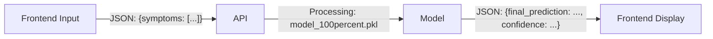

# ML Model API Data Specification

This document defines the **Input** and **Output** data formats for the Symptom Analysis Model (`model_100percent.pkl`). Use this guide to structure your frontend requests and parse the backend responses.

## 1. High-Level Data Flow



---

## 2. Input Specification (Request)
The model expects a POST request containing a list of symptoms described as strings.

**Endpoint**: `/predict`
**Method**: `POST`
**Content-Type**: `application/json`

### JSON Structure
```json
{
  "symptoms": [
    "string",
    "string"
  ]
}
```

### Example Payload
```json
{
  "symptoms": [
    "itching",
    "skin rash",
    "nodal skin eruptions"
  ]
}
```
*Note: The system is fuzzy-matched. Inputting `itching` or ` itching` (with space) or `Itching` (caps) will all map to the correct internal feature.*

---

## 3. Output Specification (Response)
The model returns a JSON object containing the primary diagnosis, alternative possibilities with confidence scores, and a confirmation of which symptoms were actually recognized.

### JSON Structure
```json
{
  "final_prediction": "String (Most likely disease)",
  "top_predictions": [
    {
      "disease": "String",
      "confidence": "String (Percentage)"
    },
    ...
  ],
  "matched_symptoms": [
    "String", 
    "String"
  ]
}
```

### Example Response
```json
{
  "final_prediction": "Fungal Infection",
  "top_predictions": [
    {
      "disease": "Fungal Infection",
      "confidence": "98.5%"
    },
    {
      "disease": "Allergy",
      "confidence": "1.2%"
    },
    {
      "disease": "Drug Reaction",
      "confidence": "0.3%"
    }
  ],
  "matched_symptoms": [
    "itching",
    "skin rash"
  ]
}
```

---

## 4. Key Fields Explained

| Field Name | Type | Description |
| :--- | :--- | :--- |
| `final_prediction` | `string` | The single disease with the highest probability score. Use this for the main display header. |
| `top_predictions` | `array` | A list of the top 3 potential diseases sorted by confidence. Useful for showing "Other possibilities". |
| `confidence` | `string` | The certainty of the model (0-100%). formatted as a percentage string. |
| `matched_symptoms` | `array` | The list of symptoms from your input that *successfully matched* the model's training data. If this list is empty, the input was invalid/typo-heavy. |

---

## 5. Error Response
If no symptoms are recognized (e.g., gibberish input), the API returns:

```json
{
  "error": "No recognized symptoms found. Try to be more specific.",
  "supported_symptoms_sample": [
    "itching",
    "skin rash",
    "stomach pain",
    "..."
  ]
}
```
