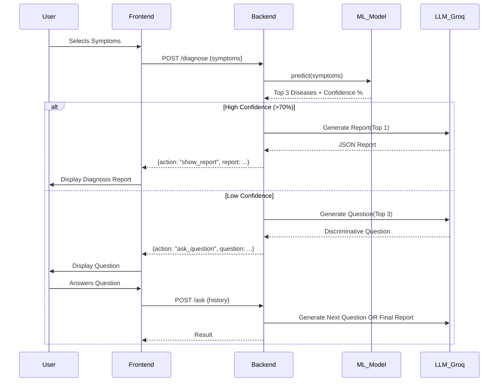

# System Architecture & Integration Report
**Project:** AI Symptom Analysis Assistant  
**Date:** December 19, 2025

## 1. Executive Summary
This report details the technical integration between the **AI Symptom Analysis** frontend and its backend services. The system utilizes a hybrid AI approach, combining a deterministic Machine Learning model (Random Forest/Ensemble) for disease probability prediction with a Large Language Model (User Llama 3.3) for natural language reasoning, patient interaction, and triage generation.

> [!IMPORTANT]
> **Medical Disclaimer & Safety Protocol**:  
> This application is a **preliminary diagnostic tool** driven by Artificial Intelligence. It is **NOT** a substitute for professional medical advice, diagnosis, or treatment.  
> *   All predictions are probabilistic and generated by ML algorithms.
> *   Users are explicitly cautioned to **consult a certified physician** for any medical concerns.
> *   In case of emergency, users should contact emergency services immediately.

## 2. System Architecture

The application follows a decoupled client-server architecture:

```mermaid
graph TD
    User[End User] <--> Client[Frontend (Next.js)]
    Client <-->|REST API / JSON| Server[Backend (FastAPI)]
    
    subgraph "Frontend Layer"
        Client --> Components[React Components]
        Components --> Hooks[Custom Hooks]
        Hooks --> APIClient[API Client Abstraction]
    end
    
    subgraph "Backend Layer"
        Server --> ML[ML Service]
        Server --> LLM[LLM Service]
        Server --> Auth[Supabase Auth]
        
        ML --> Model[Pickle Model (sklearn)]
        LLM --> Groq[Groq API (Llama 3.3)]
        Auth --> DB[(Supabase DB)]
    end
```

## 3. Frontend Architecture
**Framework:** Next.js 14+ (App Router)  
**Language:** TypeScript  
**Styling:** Tailwind CSS + Framer Motion

### Key Integration Components
1.  **`src/api/client.ts`**: The central networking layer that abstracts all HTTP requests. It handles:
    *   Base URL configuration (`http://localhost:8000`).
    *   Bearer Token injection for authenticated requests.
    *   Type definitions for `Disease`, `DiagnosisReport`, and `UserProfile`.

2.  **`ChatInterface.tsx`**: The main orchestrator component.
    *   Manages the chat state and optimistic UI updates.
    *   Handles the logic for switching between "Symptom Selection" mode and "Chat" mode.
    *   Visualizes ML confidence scores using data returned from the `/diagnose` endpoint.

3.  **Visualization**:
    *   **BodySilhouette**: Interactively maps user clicks to symptom clusters.
    *   **Visual Confidence**: Dynamically updates probability bars based on real-time backend responses.

## 4. Backend Architecture
**Framework:** FastAPI  
**Language:** Python 3.x  
**Entry Point:** `backend/main.py`

### AI Services
The backend employs a "Hybrid Engine" pattern:

1.  **ML Service (`ml_service.py`)**:
    *   **Role**: Fast, statistical pattern matching.
    *   **Tech**: Scikit-learn, `joblib`/`pickle`.
    *   **Operation**: Converts list of symptoms $\rightarrow$ One-hot vector $\rightarrow$ `model.predict_proba()` $\rightarrow$ Top 3 Diseases.
    *   **Performance**: <50ms response time.

2.  **LLM Service (`llm_service.py`)**:
    *   **Role**: Reasoning, dialogue generation, and report formatting.
    *   **Provider**: Groq (Model: `llama-3.3-70b-versatile`).
    *   **Operation**: Takes ML predictions + User History $\rightarrow$ Generates empathetic responses, follow-up questions, or final clinical reports (JSON).

3.  **Authentication (`supabase_service.py`)**:
    *   Integrates with Supabase for user management.
    *   Verifies JWT tokens passed in headers.

## 5. API Integration Specification

### A. Diagnosis Flow
The core diagnosis loop consists of two main endpoints:

#### 1. Initial Diagnosis (`POST /diagnose`)
**Trigger**: User submits initial symptoms.
*   **Input**: `{ "symptoms": ["headache", "nausea"] }`
*   **Backend Logic**:
    *   ML Model predicts disease probabilities.
    *   **IF Confidence > 70%**: LLM generates a full diagnosis report immediately.
    *   **IF Confidence < 70%**: LLM analyzes top 3 candidates and generates a *discriminative question*.
*   **Output**: Returns `action: "show_report"` OR `action: "ask_question"`.

#### 2. Iterative Q&A (`POST /ask`)
**Trigger**: User answers a follow-up question.
*   **Input**: 
    ```json
    {
      "symptoms": [...],
      "top_diseases": [...],
      "question_number": 1,
      "qa_history": [{"question": "...", "answer": "yes"}]
    }
    ```
*   **Backend Logic**:
    *   Validates conversation depth (Max 3 questions).
    *   LLM generates the next best question to separate the remaining disease candidates.
    *   After 3 questions, forces a "best guess" report.

### B. Authentication Flow
*   **Register**: `POST /auth/register` - Creates user in Supabase + Profile row.
*   **Login**: `POST /auth/login` - Returns JWT Access Token.
*   **Protected Routes**: All protected routes require `Authorization: Bearer <token>`.

## 6. Data Flow Diagram (Diagnosis Event)



## 7. Configuration & Environment
The integration relies on the following environment variables:
*   **Frontend**: `NEXT_PUBLIC_API_URL` (defaults to localhost:8000 in dev).
*   **Backend**: 
    *   `GROQ_API_KEY`: For LLM generation.
    *   `SUPABASE_URL` / `SUPABASE_KEY`: For auth (optional).
